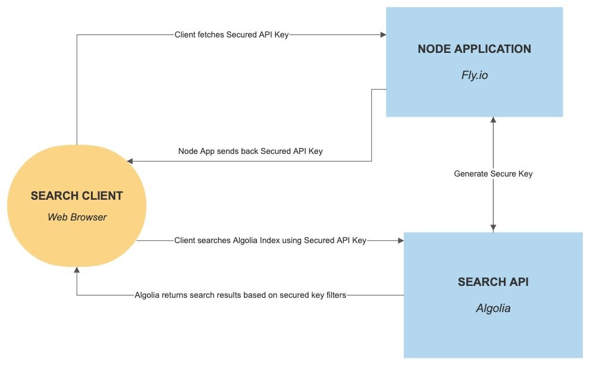
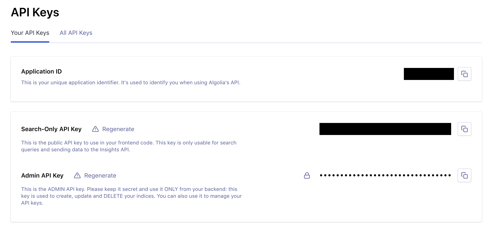
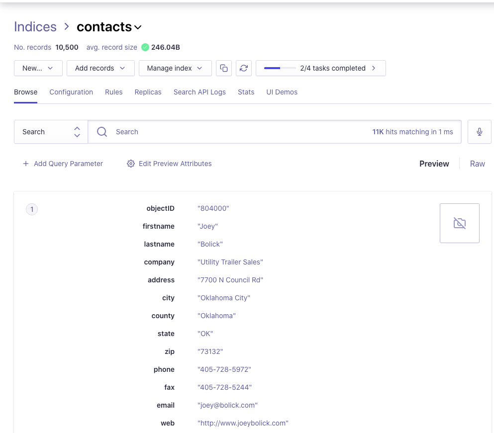
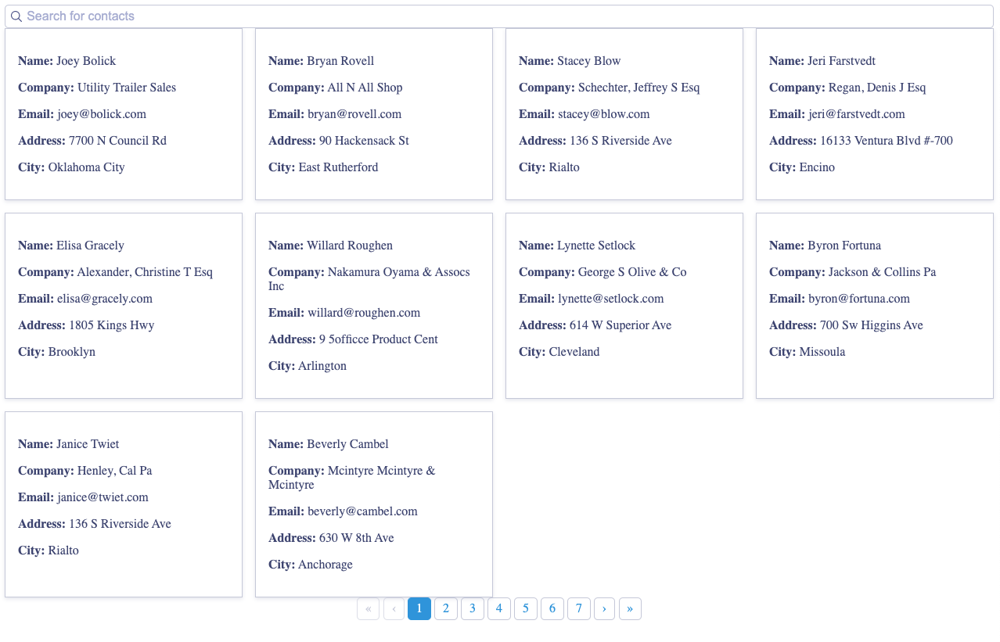

## Algolia Secured API Key Generation on the Edge

[Algolia](https://www.algolia.com/) is a hosted search service that helps you create better user experiences through fast, powerful, and easy to integrate search technology. Unlike open-source solutions like [Solr](https://lucene.apache.org/solr/) and [ElasticSearch](https://www.elastic.co/elasticsearch/), Algolia is a paid service, but Algolia provides globally distributed hosting as part of the monthly fee. Their API allows you to add search functionality to any platform or programming language.

Algolia uses API Keys to authenticate users who call their API. Your API keys must be kept secure, so typically they're only stored on your server. To take advantage of Algolia's fast, globally-distributed search index, you want to allow users to call Algolia's API directly from their browser, but you don't want to give them complete access to your API keys. Fortunately, there are ways around these limitations.

First, Algolia gives you a Search-Only API Key, which gives users unrestricted access to search all your application's indices. This is okay for some applications, but if you don't want every user to search every record, this access level is too broad. The other option is to generate a [Secured API Key](https://www.algolia.com/doc/guides/security/api-keys/#secured-api-keys-virtual), which is more restricted. You can generate a Secured API Key that is limited to a specific user, duration or index. That way, if a Secured API Key is compromised, it can't be used to gain unlimited access to search your data.

From a performance standpoint, the bottleneck becomes the generation of your Secured API Key. To generate one, you need to send an API request to your server, where a Secured API Key would be requested from Algolia's server. This extra call to your server can slow down a user's first search and degrade their experience. One way to make Secured API Key generation as fast as possible is to move it to the edge with a hosting platform like [Fly](https://fly.io/).

 

This tutorial will show you how to create an Algolia-hosted search application that generates Secured API Keys from Fly's edge hosting platform. This method makes every request - including a user's first search - as fast as possible while maintaining your Admin and Search-Only API Keys' integrity.

## Generating Secured API Keys on Fly
For this demonstration application, you'll create a Node app using the [Express](https://expressjs.com/) framework. This application will have three endpoints:

- `GET /` - The main page of your application, where users can search your Algolia index.
- `GET /index` - Creates a new search index in Algolia. Should only be called once during setup.
- `GET /key` - Generates the secured API key using the Algolia API.

After testing the application locally, you'll see how to deploy it to Fly's edge hosting network to maximize performance. If you'd like to skip ahead to the finished code, you can find it [on GitHub](https://github.com/karllhughes/fly-algolia-secured-key).

### Prerequisites
- The [Flyctl command line tool](https://fly.io/docs/flyctl/installing/).
- [Node](https://nodejs.org/) and [npm](https://www.npmjs.com/) installed locally.
- An [Algolia](https://www.algolia.com/users/sign_up) account.

### Creating the Express Application
Create a new folder for your application. From this folder, initialize a new Node app using [`npm init`](https://docs.npmjs.com/cli/init). Set all the options to the default except for the "entry point", which should be `app.js`. 
 
Next, install [Express](https://expressjs.com/) and the [Algolia search package](https://www.npmjs.com/package/algoliasearch).

```bash
npm i express algoliasearch --save
```

To make `npm start` work for local testing, open up your `package.json` file and add the following to your `scripts` array:

```json
...
"scripts": {
  "start": "node app.js",
...
```

Create an `app.js` file in the root directory of your new application. This file will contain the three endpoints you need for this Express app. Add the following to the file:

```javascript
const express = require('express');
const app = express();
const port = '8080';
const algoliasearch = require('algoliasearch');
const client = algoliasearch(
  process.env.ALGOLIA_APP_ID, 
  process.env.ALGOLIA_ADMIN_API_KEY
);
const index = client.initIndex('contacts');

app.use(express.static('src'));

app.get('/', function (req, res) {
  res.sendFile(__dirname + '/src/html/index.html');
});

app.get('/index', function (req, res) {
  // Coming soon
});

app.get('/key', function (req, res) {
  // Coming soon
});

app.listen(port, function () {
  console.log(`App listening on port ${port}`);
});
```

When you're done, your application will display a list of results from your Algolia search index, so you need an HTML file to display the results. Create a new file at `src/html/index.html` that contains the following:

```html
<!doctype html>
<head>
  <meta charset="UTF-8">
  <link rel="stylesheet" href="https://cdn.jsdelivr.net/npm/instantsearch.css@7.3.1/themes/algolia-min.css" integrity="sha256-HB49n/BZjuqiCtQQf49OdZn63XuKFaxcIHWf0HNKte8=" crossorigin="anonymous">

  <style>
    .prop {
      font-weight:bold;
    }

    .hit div {
      margin-top: 1em;
      margin-bottom: 1em;
    }
  </style>
</head>
<body>

  <header>
    <div id="search-box"></div>
  </header>

  <main>
      <div id="hits"></div>
      <div id="pagination"></div>
  </main>

  <script type="text/html" id="hit-template">
    <div class="hit">
      <div class="hit-name">
        <span class="prop">Name:</span> {{#helpers.highlight}}{ "attribute": "firstname" }{{/helpers.highlight}}
        {{#helpers.highlight}}{ "attribute": "lastname" }{{/helpers.highlight}}
      </div>
      <div class="hit-company">
        <span class="prop">Company:</span> {{#helpers.highlight}}{ "attribute": "company" }{{/helpers.highlight}}
      </div>
      <div class="hit-email">
        <span class="prop">Email:</span> {{#helpers.highlight}}{ "attribute": "email" }{{/helpers.highlight}}
      </div>
      <div class="hit-address">
        <span class="prop" >Address:</span> {{#helpers.highlight}}{ "attribute": "address" }{{/helpers.highlight}}
      </div>
      <div class="hit-city">
        <span class="prop">City:</span> {{#helpers.highlight}}{ "attribute": "city" }{{/helpers.highlight}}
      </div>
    </div>
  </script>

  <script src="https://cdn.jsdelivr.net/npm/algoliasearch@4.0.0/dist/algoliasearch-lite.umd.js" integrity="sha256-MfeKq2Aw9VAkaE9Caes2NOxQf6vUa8Av0JqcUXUGkd0=" crossorigin="anonymous"></script>
  <script src="https://cdn.jsdelivr.net/npm/instantsearch.js@4.0.0/dist/instantsearch.production.min.js" integrity="sha256-6S7q0JJs/Kx4kb/fv0oMjS855QTz5Rc2hh9AkIUjUsk=" crossorigin="anonymous"></script>
  <script src="/js/index.js"></script>
</body>
```

This scaffolding sets up your Express application, but you still need to connect it to Algolia to generate the secured key and get the search results.

### Setting Up the Search Index
Before you can run the application, you'll need to create a new search index on Algolia and load some data into it. If you don't already have an [Algolia](https://www.algolia.com/) account, you'll need to create one for this step.

Log into your Algolia account and go to your dashboard. From there, click the **API Keys** link on the left side-bar. Copy the **Application ID**, **Search-Only API Key**, and **Admin API Key**. You'll need these to test your Node app and deploy it to Fly.



Your Express application has an endpoint at `GET /index` that you'll use to create the search index in Aglolia and load some sample data. In your `app.js` file, replace the `/index` endpoint with the following:

```javascript
app.get('/index', function (req, res) {
  // Import contacts.json
  const contactJSON = require('./contacts.json');

  // Push data to the index if it does not exist yet.
  index.exists().then(exists => {
    if (!exists) {
      index.saveObjects(contactJSON, {
        autoGenerateObjectIDIfNotExist: true
      }).then(({ objectIDs }) => {
        // Set attributes to be searched
        index.setSettings({
          searchableAttributes: [
            'lastname',
            'firstname',
            'company',
            'email',
            'city',
            'address'
          ]
        }).then(() => {
          res.send('Index created.');
        }).catch(e => console.error(e));
      }).catch(e => console.error(e));
    } else {
      res.send('Index already exists.');
    }
  }).catch(e => console.error(e));
});
```

The code above creates an index and then loads the JSON data from `contacts.json` into Algolia. Copy the contents of [this `contacts.json` file](https://github.com/karllhughes/fly-algolia-secured-key/blob/main/contacts.json), which contains several hundred fake contacts:

```json
[
  {
    "firstname": "Essie",
    "lastname": "Vaill",
    "company": "Litronic Industries",
    "address": "14225 Hancock Dr",
    "city": "Anchorage",
    "county": "Anchorage",
    "state": "AK",
    "zip": "99515",
    "phone": "907-345-0962",
    "fax": "907-345-1215",
    "email": "essie@vaill.com",
    "web": "http://www.essievaill.com",
    "followers": 3574
  },
...
`" 

Now you are ready to start your Express app and load some data into Algolia. Run the following from your terminal with your Algolia credentials:

```bash
ALGOLIA_APP_ID=<YOUR_APP_ID> \
ALGOLIA_SEARCH_ONLY_KEY=<YOUR_SEARCH_ONLY_KEY> \
ALGOLIA_ADMIN_API_KEY=<YOUR_ADMIN_API_KEY> \
npm start
```

Go to `localhost:8080/index` in your browser, and you should see the message, "Index created" when the data import is complete.

To confirm that the `Contact` index is up on Algolia, visit the Algolia Dashboard, on the left sidebar, click on **Indices**. You should see something like the following:



### Generating a Secured API Key
Now that you have data in your Algolia index, you're ready to create a Secured API Key to access it. The Secured API Key is crucial because it ensures that the unrestricted Search-Only Key provided by Algolia is not exposed. Malicious users could use the Search-Only Key to access unlimited search at the application's expense.

To generate a Secured API Key on the server, you need to update the `/key` endpoint. Replace that code with the following:

```javascript
app.get('/key', function (req, res) {
  // An addHours date function
  Date.prototype.addHours = function(h) {
    this.setTime(this.getTime() + (h*60*60*1000));
    return this;
  };

  // Generate Algolia API Key and set it to expire in 1 hour
  const securedKey = client.generateSecuredApiKey(
    process.env.ALGOLIA_SEARCH_ONLY_KEY,
    {validUntil: new Date().addHours(1).getTime()}
  );

  return res.json({
    'algolia_app_id': process.env.ALGOLIA_APP_ID,
    'secured_api_key': securedKey
  });
});
```

This uses the [Algolia API method `generateSecuredApiKey`](https://www.algolia.com/doc/api-reference/api-methods/generate-secured-api-key/) and the Search-Only API key, to generate the Secured API Key. By setting the `validUntil` property to one hour, you can minimize the impact of this key falling into a malicious user's hands. The generated key, along with the Application ID, is returned in the response from Algolia.

### Retrieve the Secured API Key
Since you need the Secured API key in the UI to perform a search with the Algolia search client, you need to create a [fetch request](https://developers.google.com/web/updates/2015/03/introduction-to-fetch) to your Node server that calls the `GET /key` route defined above.

Create a JavaScript file at `src/js/index.js` and add the following:

```javascript
fetch('/key').then(
  function (response) {
      if (response.ok) {
          response.json().then(function (data) {
              const secured_api_key = data.secured_api_key
              const algolia_app_id = data.algolia_app_id
              searchContacts(algolia_app_id, secured_api_key)
          });
      } else {
          throw new Error('Something went wrong');
      }
  }
).catch(function error (err) {
    console.log('An error occurred while fetching API Key', err)
});

function searchContacts(app_id, secured_key) {
    const searchClient = algoliasearch(
        app_id,
        secured_key // Secured API key, not admin API key
    );

    const search = instantsearch({
        indexName: 'contacts',
        searchClient,
        routing: true,
    });

    search.addWidgets([
        instantsearch.widgets.configure({
            hitsPerPage: 12,
        })
    ]);

    search.addWidgets([
        instantsearch.widgets.searchBox({
            container: '#search-box',
            placeholder: 'Search for contacts',
        })
    ]);

    search.addWidgets([
        instantsearch.widgets.hits({
            container: '#hits',
            templates: {
                item: document.getElementById('hit-template').innerHTML,
                empty: `We didn't find any results for the search <em>"{{query}}"</em>`,
            },
        }),
        instantsearch.widgets.pagination({
            container: '#pagination',
        }),
    ]);

    search.start();
}
```

The code retrieves the Secured API key and Application ID from the Node server and passes them to the `searchContact` function. This function is where the actual search happens.

### Testing the App Locally
Since you already added the UI for this application in the `src/html/index.html` file above, you're now ready to test the application. Restart the Node server using the same environment variables you did above and view the app running at `http://localhost:8080`.



You can search for contacts on the app. The results are retrieved from the Algolia index and should contain all of the contacts you imported previously.

### Deploying the Application to Fly
The final step is to take advantage of the speed of Fly's edge hosting network by deploying your app to Fly. 

Before you deploy your application to Fly, it needs to have a Dockerfile. Fly uses this to package up the app and install the dependencies. Create a `Dockerfile` in the root of your application and add the following:

```dockerfile
FROM node:current-alpine

WORKDIR /app

COPY package.json .
COPY package-lock.json .

RUN npm install --production

COPY . .

CMD ["npm", "start"]
```

Each Fly application also needs a `fly.toml` file to tell Fly how to deploy it. This file can be generated using the `flyctl` command-line tool. If you have not already installed the correct version of `flyctl` for your operating system, follow the [instructions here](https://fly.io/docs/hands-on/installing/).

Next, sign up or sign in to your Fly account:

```
# Sign up
flyctl auth signup

# Or sign in
flyctl auth login
```

Create the `fly.toml` file using `flyctl init`.

You'll be asked for an application name. It's probably best to use the recommended name because it is always unique. Select your organization, the "Dockerfile" builder, and the default port ("8080"). The `fly.toml` is created at the end of the session and should look like this:

```
# fly.toml file generated for snowy-haze-2901 on 2020-08-28T03:26:10+01:00

app = "snowy-haze-2901"


[[services]]
  internal_port = 8080
  protocol = "tcp"

  [services.concurrency]
    hard_limit = 25
    soft_limit = 20

  [[services.ports]]
    handlers = ["http"]
    port = "80"

  [[services.ports]]
    handlers = ["tls", "http"]
    port = "443"

  [[services.tcp_checks]]
    interval = 10000
    timeout = 2000
```

To make your Algolia credentials available to your Fly application, use the [`flyctl secrets` command](https://fly.io/docs/flyctl/secrets/):

```bash
flyctl secrets set \
ALGOLIA_APP_ID=<YOUR_APP_ID> \
ALGOLIA_SEARCH_ONLY_KEY=<YOUR_SEARCH_ONLY_KEY> \
ALGOLIA_ADMIN_API_KEY=<YOUR_ADMIN_API_KEY>
```

Replace `YOUR_APP_ID`, `YOUR_SEARCH_ONLY_KEY`, `YOUR_ADMIN_API_KEY` with the actual values as you did when running `npm start` locally.

Deploy your application to Fly:

```bash
flyctl deploy
```

After the Docker image has been built and deployed to Fly, you can view the application by running:

```bash
flyctl open
```

You should see the same thing as you did when you ran the application locally. If you inspect the XHR requests being made when you load the app, you'll see that the first call is to your Node application to get the Secured API Key. Subsequent calls to search the results in Algolia are made directly to their globally distributed search index.

## Conclusion
In this tutorial, you've seen how to deploy a Node application that generates a Secured API Key for Algolia. Your application used that key to request results from Algolia's global search index without exposing your Search-Only API Key.

People expect faster and more seamless results when searching online, so hosting API key generation on the edge can be a worthwhile investment. If every millisecond matters in your search application, take a look at [Fly.io](https://fly.io) to get the best performance from every web request.
